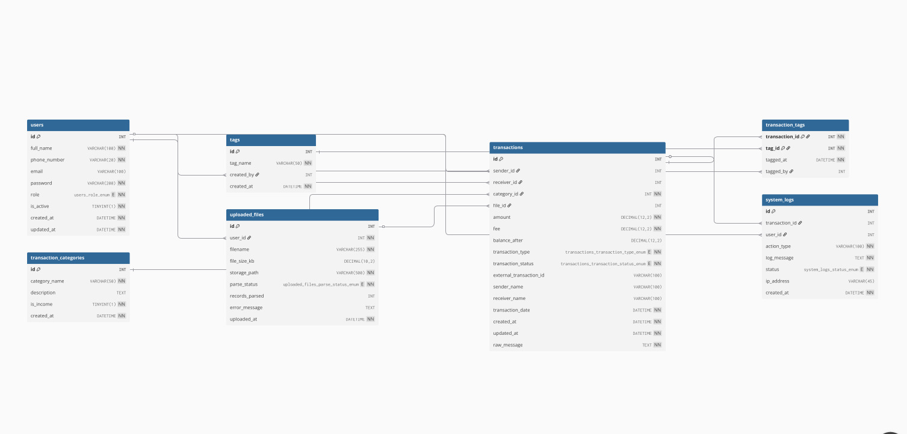

Project Description

MoMo SMS Analyzer System is a complete enterprise application that enables the import, management and analytics of Mobile Money SMS transactions in XML format. The system enables users to upload XML files with MoMo SMS records, which transaction data is automatically extracted as well as cleaned, categorized according to the type of transaction and stored in a relational database.nq
## System architecture

Interactive diagram (Eraser): https://app.eraser.io/workspace/znYjFYirT5nuLa2PLyfn?origin=share
## Database Design

### Entity Relationship Diagram

| Table                    | Description                                                                 |
|--------------------------|-----------------------------------------------------------------------------|
| `users`                  | Stores user accounts with role, contact info, and active status             |
| `transaction_categories` | Classifies transactions as income or expense with a description             |
| `tags`                   | User-created labels that can be applied to transactions                     |
| `uploaded_files`         | Tracks every XML file upload, its parse status, and processing metadata     |
| `transactions`           | Core table storing every MoMo transaction with sender, receiver, amount, fee, balance, type, and status |
| `transaction_tags`       | Junction table resolving the many-to-many relationship between transactions and tags |
| `system_logs`            | Logs every action taken on a transaction or by a user, including IP address and status |

## Scrum board

https://alustudent-team-ewd3ksc.atlassian.net/jira/software/projects/SCRUM/boards/1?atlOrigin=eyJpIjoiNjFhMjljYTQyYzI5NDdlMWI5NmNiOTllZjljZmFkNjIiLCJwIjoiaiJ9 

## Team Members
- Chigozirim Menankiti
- Samuel Nizeyimana
- Mamashenge Kendra 
 ## Team Name : KSC
