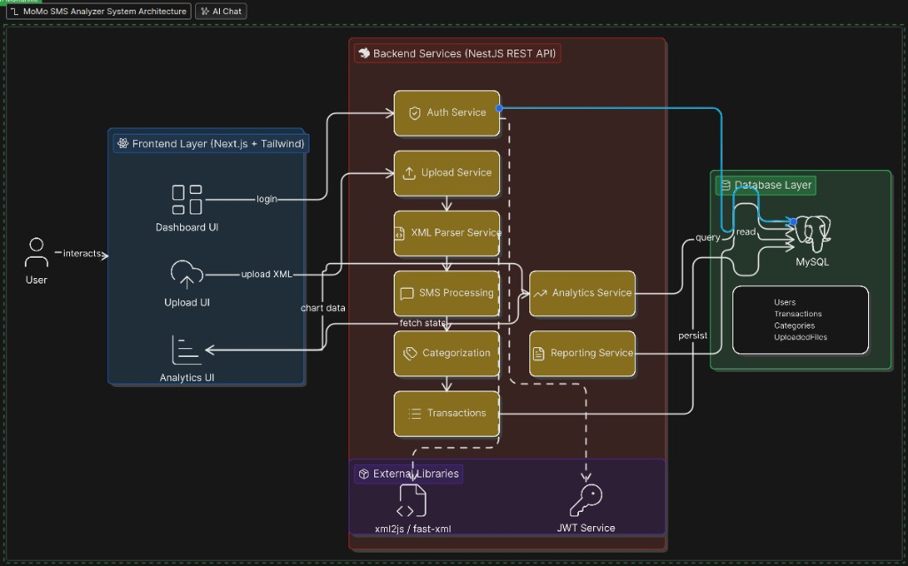

Project Description

MoMo SMS Analyzer System is a complete enterprise application that enables the import, management and analytics of Mobile Money SMS transactions in XML format. The system enables users to upload XML files with MoMo SMS records, which transaction data is automatically extracted as well as cleaned, categorized according to the type of transaction and stored in a relational database.nq
## System architecture

Interactive diagram (Eraser): https://app.eraser.io/workspace/znYjFYirT5nuLa2PLyfn?origin=share

## Scrum board

https://alustudent-team-ewd3ksc.atlassian.net/jira/software/projects/SCRUM/boards/1?atlOrigin=eyJpIjoiNjFhMjljYTQyYzI5NDdlMWI5NmNiOTllZjljZmFkNjIiLCJwIjoiaiJ9 

## Team Members
- Chigozirim Menankiti
- Samuel Nizeyimana
- Mamashenge Kendra 
 ## Team Name : KSC
